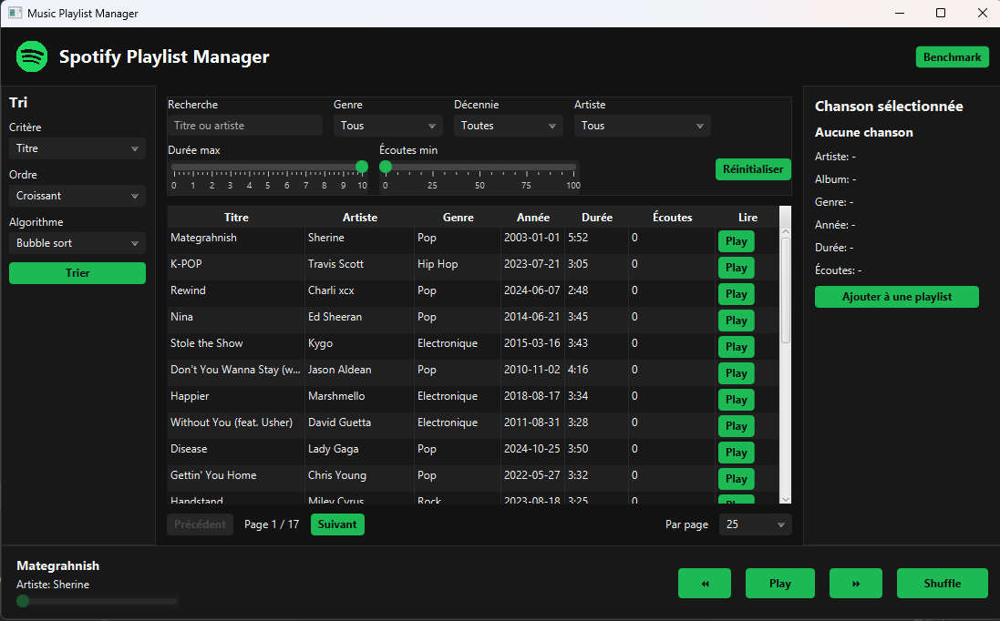
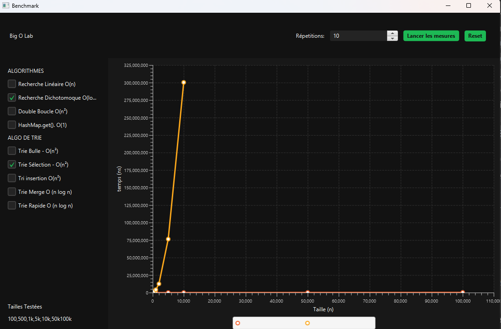

# Mudic Catalog - Lab2

**Cours** : 420-930-MA — Algorithmes et modèles de programmation
**Session** : Été 2026, groupe 25604
**Laboratoire** : 2 (Application JavaFX v1)
**Date de remise** : 11 septembre 2026, 23h59

---

## Équipe

| Nom complet    | Adresse courriel   | Contribution principale           |
| -------------- |--------------------| --------------------------------- |
| Émile Valade   | e.valade@proton.me | Modèle + Service + Tris (backend) |
| Jean-Simon Cyr | jsimcyr@gmail.com  | XML + Controller + CSS (frontend) |

---

## Sujet choisi

**Numéro du sujet** : 3
**Nom du sujet** : Spotify Playlist Manager

---

## 🔗 Lien du dépôt GitHub PUBLIC

**URL** : https://github.com/Kkiriya/Music-Playlist-Manager

> ⚠️ Vérifier que le dépôt est **PUBLIC** et accessible sans authentification.
> Tester le lien dans un navigateur privé avant la remise.

---

## Fonctionnalités implémentées

### ✅ Obligatoires (cocher ce qui est fait)

- [X] Architecture MVC avec packages séparés (model / service / algorithmes / controller / util)
- [X] Chargement des données depuis fichier CSV (nombre de lignes : 420 chansons)
- [X] Interface JavaFX principale avec liste/tableau
- [X] Panneau détail affichant l'élément sélectionné
- [X] Pagination fonctionnelle (taille de page : 25 par defaut, options 10 / 25 / 50 / 100)
- [X] Filtres multi-critères combinables (nombre implémentés : 5 / 4 demandés)
- [X] Recherche par texte en temps réel
- [X] Interface Algorithme définie
- [X] Tri #1 implémenté : Bubble sort
- [X] Tri #2 implémenté : Selection sort
- [X] Tri #3 implémenté : Insertion sort
- [X] Comparateur/benchmark des tris avec mesure du temps
- [ ] Wishlist / Favoris (ajout, retrait, pas de doublons)
- [X] CSS appliqué (thème visuel du projet)

### 🎁 Bonus (cocher ce qui est fait)

- [X] Aucun

### ❌ Non implémenté (assumer honnêtement)

- Tout ce qui est playlist
- Recherche insensible aux accents

---

## Structure du projet

```
Music-Playlist-Manager/
|-- pom.xml
|-- src/main/java/
|   |-- module-info.java
|   `-- com/maisonneuve/music_playlist_manager/
|       |-- MainFx.java
|       |-- model/
|       |-- algorithm/
|       |-- controller/
|       `-- util/
`-- src/main/resources/com/maisonneuve/music_playlist_manager/
    |-- fxml/principal.fxml
    |-- views/lab.fxml
    |-- styles/theme.css
    |-- assets/
    `-- data/songs.csv
```

---

## Instructions pour lancer le projet

### Prérequis

- JDK 17 ou plus
- Maven 3.x
- (optionnel) IntelliJ IDEA / Eclipse

### Étapes

```bash
# 1. Cloner le dépôt
git clone https://github.com/Kkiriya/Music-Playlist-Manager
cd Music-Playlist-Manager

# 2. Compiler
mvn clean compile

# 3. Lancer l'application
mvn javafx:run
```

### Alternative dans IntelliJ

1. Ouvrir le projet dans IntelliJ (File > Open > dossier du projet)
2. Attendre que Maven télécharge les dépendances
3. Ouvrir `MainFx.java`
4. Cliquer sur le bouton Run

---

## Choix techniques

### Version Java utilisée

Java 17 avec JavaFX 21.

### Format des données

CSV avec virgule comme séparateur, lu avec OpenCSV en UTF-8. Le fichier contient 420 chansons.

### Algorithmes de tri implémentés

- Bubble sort : O(n^2)
- Selection sort : O(n^2)
- Insertion sort : O(n^2)
- Merge sort : O(n log n)
- Quick sort : O(n log n) en moyenne

### Bibliothèques externes utilisées

- OpenCSV pour lire le fichier CSV

---

## Difficultés rencontrées

- Lecture du CSV avec des champs contenant des virgules : utilisation de OpenCSV.
- Mise à jour du tableau JavaFX apres les filtres, tris et pagination.
- Organisation du contrôleur principal en petites classes pour garder le code plus lisible.

---

## Répartition du travail (auto-évaluation)

| Membre  | % contribution estimée | Ce sur quoi j'ai travaillé                                                       |
| ------- | ---------------------- |----------------------------------------------------------------------------------|
| Emile Valade | 25% | Base du modele, diagramme de classes,transformation des données |
| Jean-Simon Cyr | 75% | FXML, controleurs, chargement CSV, filtres, pagination, tri, benchmark, CSS      |

---

## Notes pour le correcteur

Le benchmark est accessible avec le bouton `Benchmark` dans la barre du haut.

---

## Captures d'écran (fortement recommandé)

### Écran principal



### Écran de benchmark



---

## Historique Git

**Nombre total de commits** : 30
**Date du premier commit** : 2026-09-08
**Date du dernier commit** : 2026-09-13

Voir l'onglet **Insights > Contributors** de GitHub pour voir la contribution de chacun.

---
