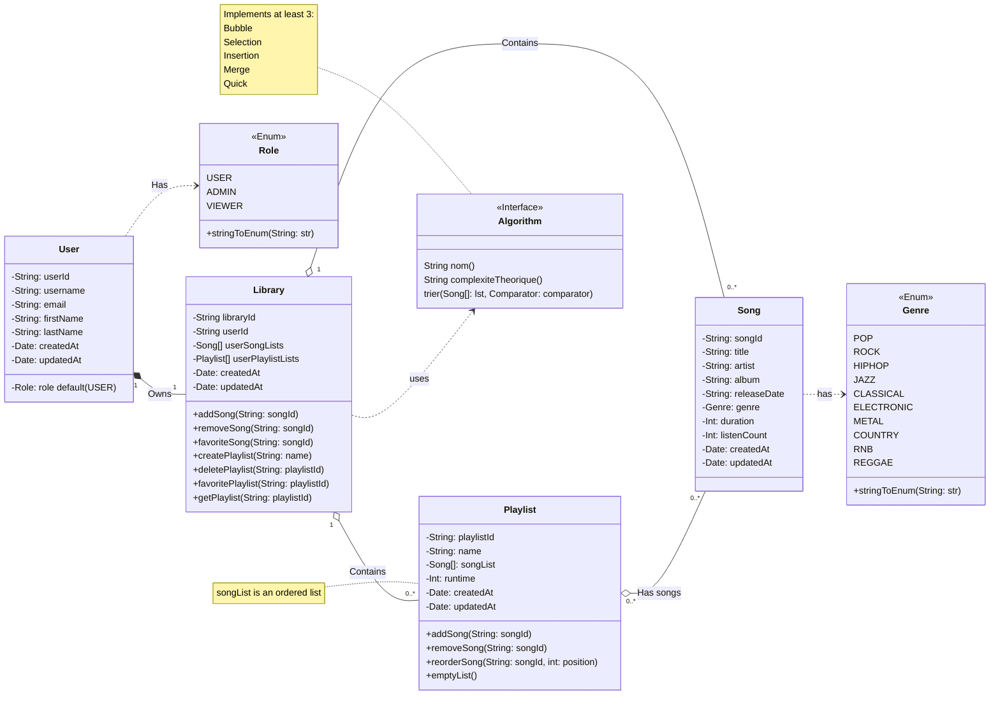

# Diagrams

## Class Diagram for Music Playlist Manager

```mermaid
classDiagram
    direction LR

    User "1" *-- "1" Library : Owns
    User ..> Role : Has

    Library "1" o-- "0..*" Song : Contains
    Library "1" o-- "0..*" Playlist : Contains

    Playlist "0..*" o-- "0..*" Song : Has songs

    Song ..> Genre : has

    Library ..> Algorithm: uses


    class Role {
        <<Enum>>
        USER
        ADMIN
        VIEWER

        +stringToEnum(String: str)
    }

    class User {
        -String: userId
        -String: username
        -String: email
        -String: firstName
        -String: lastName
        -Role: role default(USER)

        -Date: createdAt
        -Date: updatedAt
    }

    note for Algorithm "Implements at least 3: <br>Bubble <br>Selection <br>Insertion <br>Merge <br>Quick"
    class Algorithm {
        <<Interface>>
        String nom()
        String complexiteTheorique()
        trier(Song[]: lst, Comparator: comparator)
    }

    class Genre {
        <<Enum>>
        POP
        ROCK
        HIPHOP
        JAZZ
        CLASSICAL
        ELECTRONIC
        METAL
        COUNTRY
        RNB
        REGGAE
        +stringToEnum(String: str)
    }


    class Song {
        -String: songId
        -String: title
        -String: artist
        -String: album
        -String: releaseDate
        -Genre: genre
        -Int: duration
        -Int: listenCount

        -Date: createdAt
        -Date: updatedAt
    }

    note for Playlist "songList is an ordered list"

    class Playlist {
        -String: playlistId
        -String: name
        -Song[]: songList
        -Int: runtime

        -Date: createdAt
        -Date: updatedAt

        +addSong(String: songId)
        +removeSong(String: songId)
        +reorderSong(String: songId, int: position)
        +emptyList()
    }

    class Library {
        -String libraryId
        -String userId
        -Song[] userSongLists
        -Playlist[] userPlaylistLists

        -Date: createdAt
        -Date: updatedAt

        +addSong(String: songId)
        +removeSong(String: songId)
        +favoriteSong(String: songId)
        +createPlaylist(String: name)
        +deletePlaylist(String: playlistId)
        +favoritePlaylist(String: playlistId)
        +getPlaylist(String: playlistId)
    }
```
