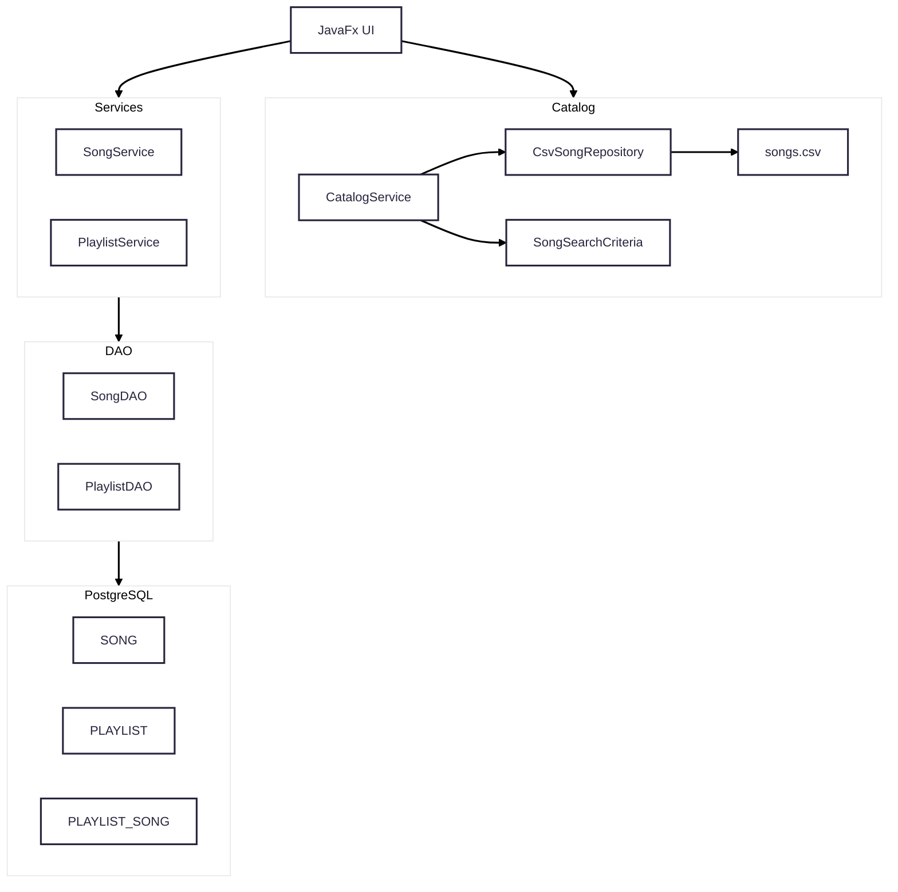
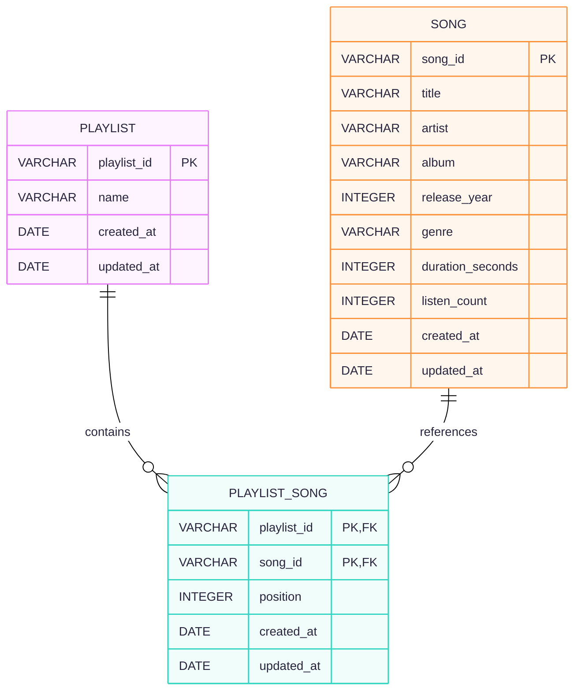
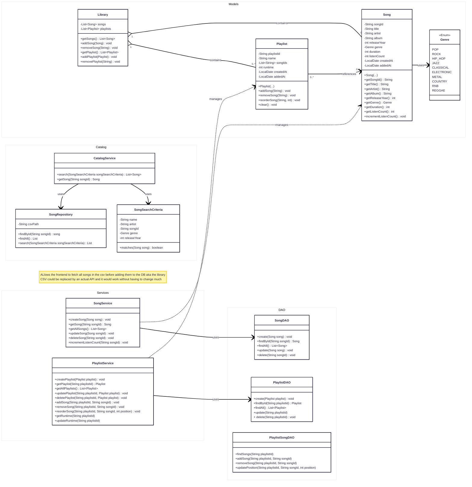

# Overall project architecture

## Architecture Diagram
represents the overall flow of the program

## Entity Relation Diagram 
represents PostgreSQL DB

## Class Diagram
represent the structure of the backend itself

